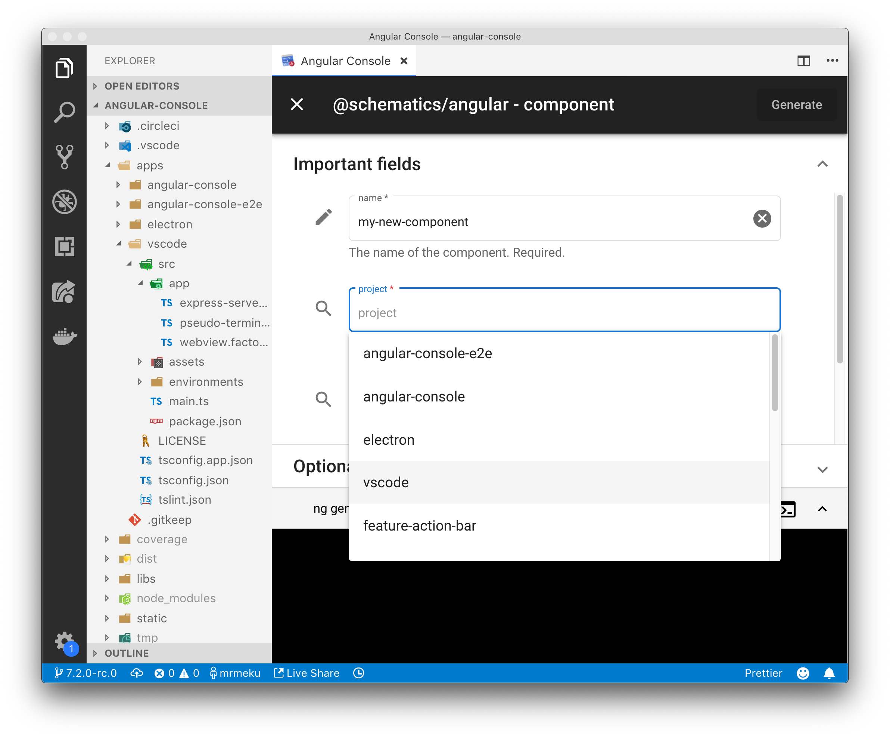

    

# The UI for the Angular CLI

### Spend less time looking up command line arguments and more time shipping incredible products.

Angular CLI transformed the Angular ecosystem. With it, you can get a full-stack application up and running in minutes, no need to figure out source maps, webpack, test runners. It all works out of the box. Angular CLI also helps you enforce consistent development practices by generating components, services, and state management modules.

## Why Nx Console?

Professional developers use both command-line tools and user interfaces. They commit in the terminal, but resolve conflicts in VSCode or WebStorm. They use the right tool for the job.

Angular CLI is a command-line tool, which works great when you want to serve an application or generate a simple component. But it falls short once you start doing advanced things.

For instance:

- Exploring custom schematic collections is hard in the terminal, but it's easy using Nx Console.
- Using rarely-used flags is challenging. Do you pass absolute or relative paths? You don't have to remember any flags, names, or paths -- Nx Console will help you by providing autocompletion and validating your inputs.
- Finding the right Angular CLI extension can take a long time. When using Nx Console, you can find and install an extension in minutes.

Nx Console does all that and more!

## Download

For VSCode users, you can install the [Nx Console VSCode Plugin](https://marketplace.visualstudio.com/items?itemName=nrwl.angular-console) from Marketplace.

## True UI for the Angular CLI

Nx Console is an UI for the Angular CLI. It will work for any schematic or any architect commands. Nx Console does not have a specific UI for, say, generating a component. Instead, Nx Console does what the command-line version of the Angular CLI does--it analyzes the same meta information to create the needed UI. This means that anything you can do with the Angular CLI, you can do with Nx Console. After all, Nx Console is the UI for the Angular CLI.

## Useful for Both Experts and Beginners

Even though we started building Nx Console as a tool for expert, we also aimed to make Nx Console a great tool for developers who are new to Angular or Angular CLI. You can create projects, interact with your editor, run generators and commands, install extensions without ever touching the terminal or having to install any node packages globally. If you get a new laptop, you can install Nx Console and start building Angular apps. Also, Nx Console highlights the properties you are likely to use for build-in generators and commands . So if you haven't used the CLI, you don't get overwhelmed.

## Great for Windows Users

A lot of Windows users are terminal shy and cannot take full advantage of tools like the Angular CLI and [Nrwl Nx](http://nrwl.io/nx). By using Nx Console, Windows users can start using the powerful capabilities these tools provide via an easy-to-use UI. They can create new projects, generate components, build, test, deploy Angular apps without having to even open the terminal.

# Learn More

- [angularconsole.com](http://angularconsole.com) - the official site of the project
- [Watch Nx Console 5-minute overview video by Angular Firebase folks](https://www.youtube.com/watch?time_continue=18&v=d2K2Cp8BJx0)
- [Angular CLI course by John Papa](https://www.pluralsight.com/courses/angular-cli) - the Angular CLI course by John Papa has a video on Nx Console
- [Learn more about the team at Nrwl](https://www.nrwl.io) - The team at Nrwl led the development of Nx Console, after working with many Enterprise clients.

# Contribute

Please read the [contributing](https://github.com/nrwl/angular-console/blob/master/CONTRIBUTING.md) guidelines.
Pick one of the issues from the [good first issue](https://github.com/nrwl/angular-console/issues?q=is%3Aopen+is%3Aissue+label%3A%22good+first+issue%22) list to get started.

## Core Team

| Dan Muller                          | Victor Savkin                         | Jack Hsu                            | Frantisek Kolar                     | Kamil Kisiela                                   |
| ----------------------------------- | ------------------------------------- | ----------------------------------- | ----------------------------------- | ----------------------------------------------- |
| ![Dan Muller][dm]                   | ![Victor Savkin][vs]                  | ![Jack Hsu][jh]                     | ![Frantisek Kolar][fk]              | ![Kamil Kisiela][kk]                            |
| [mrmeku](https://github.com/mrmeku) | [vsavkin](https://github.com/vsavkin) | [jaysoo](https://github.com/jaysoo) | [fkolar](https://github.com/fkolar) | [kamilkisiela](https://github.com/kamilkisiela) |

[dm]: https://raw.githubusercontent.com/nrwl/angular-console/master/static/dan_pic.jpg
[vs]: https://raw.githubusercontent.com/nrwl/angular-console/master/static/victor_pic.jpg
[jh]: https://raw.githubusercontent.com/nrwl/angular-console/master/static/jack_pic.jpg
[fk]: https://avatars0.githubusercontent.com/u/17149942?s=150&v=4
[kk]: https://avatars1.githubusercontent.com/u/8167190?s=150&v=4

The following folks from the Angular team at Google are working with the Nx Console team.

| Alex Eagle        | Stephen Fluin        | Matias Niemelä        |
| ----------------- | -------------------- | --------------------- |
| ![Alex Eagle][ae] | ![Stephen Fluin][sf] | ![Matias Niemelä][mn] |

[ae]: https://raw.githubusercontent.com/nrwl/angular-console/master/static/alex_eagle_pic.jpg
[sf]: https://raw.githubusercontent.com/nrwl/angular-console/master/static/stephen_pic.jpg
[mn]: https://raw.githubusercontent.com/nrwl/angular-console/master/static/matias_pic.jpg
