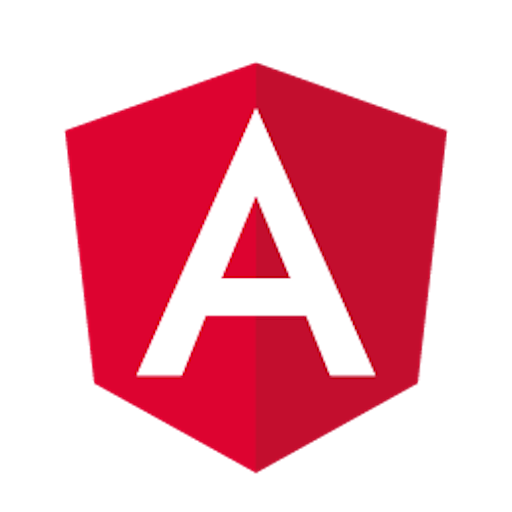

<h1 align="center">
	
     
    
Angular Console

     
</h1>

<h3 align="center">
    The Power of the Angular CLI. The Convenience of an App.
</h3>

<h4 align="center">
    Spend less time looking up command line arguments and more time shipping incredible products.
</h4>

	
	 
    
    

# What is Angular Console?

**Angular Console is the user interface for the Angular CLI**.

It allows you to create new projects, install extensions, generate artifacts, build, test, and deploy your projects. Anything you can do with the Angular CLI, you can do with Angular Console. It also gives you a visual overview of your projects.

# Why Angular Console?

### Easy to Get Started with Angular

Angular Console comes with node, npm and the Angular CLI included. You can get a brand new laptop, install Angular Console, and start working on Angular apps. No need to learn node or npm, no more confusion about installing global npm or yarn packages.

### Great for Windows Users

A lot of Windows users are terminal shy and cannot take full advantage of tools like the Angular CLI and [Nrwl Nx](http://nrwl.io/nx). By using Angular Console, Windows users can start using the powerful capabilities these tools provide via an easy-to-use UI. They can create new projects, generate components, build, test, deploy Angular apps without having to even open the terminal.

### True UI for the Angular CLI

Angular Console is a generic UI for the Angular CLI. It will work for any schematic or any architect commands. Angular Console does not have a specific UI for, say, generating a component. Instead, Angular Console does what the command-line version of the Angular CLI does--it analyzes the same meta information to create the needed UI. This means that anything you can do with the Angular CLI, you can do with Angular Console. After all, Angular Console is the UI for the Angular CLI.
