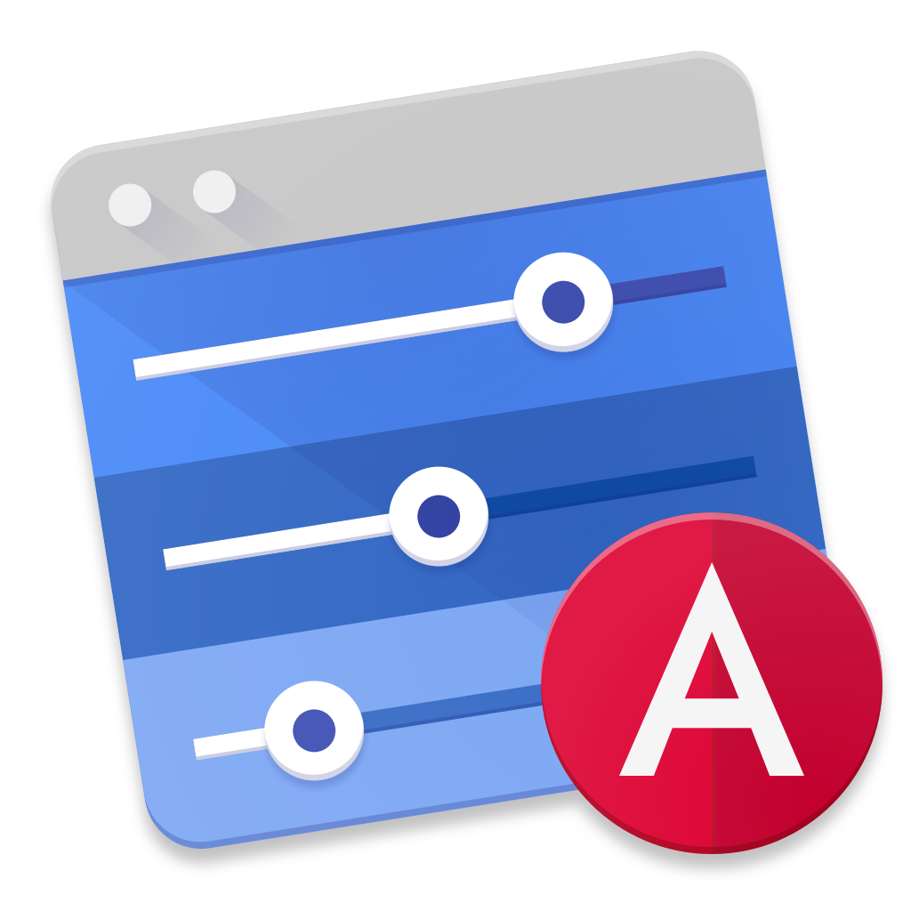

<h1 align="center">
	
     
    
Angular Console

     
</h1>

<h3 align="center">
    The Power of the Angular CLI. The Convenience of an App.
</h3>

<h4 align="center">
    Spend less time looking up command line arguments and more time shipping incredible products.
</h4>

	
	 
    
    

# What is Angular Console?

Angular CLI transformed the Angular ecosystem. We no longer have to spend time maintaining our webpack configurations, figuring out how to make tests run, fixing source maps — the CLI does this for us. It also helps us enforce consistent development practices by generating components, services, and state management modules. Since the CLI does so much, it can be intimidating and hard to learn. Most developers only use a fraction of the CLI’s capabilities.

**Angular Console is the user interface for the Angular CLI**.

We realized that most developers don’t need more sophisticated commands — they need a more approachable way to use what the Angular CLI already does. And that’s what Angular Console is.

Using Angular Console you can create new projects, install extensions, generate artifacts, build, test, and deploy your projects. Anything you can do with the Angular CLI, you can do with Angular Console. It also gives you a visual overview of your projects.

### You can download Angular Console at [angularconsole.com](https://angularconsole.com/). We provide distributions for Windows, Mac, and Linux.

# Who is it for

## Beginner Friendly

We aim to make Angular Console a great tool for developers who are new to Angular or Angular CLI. You can create projects, interact with your editor, run generators and commands, install extensions without ever touching the terminal or having to install any node packages globally. If you get a new laptop, you can install Angular Console and start building Angular apps. Also, Angular Console highlights the properties you are likely to use for build-in generators and commands . So if you haven’t used the CLI, you don’t get overwhelmed.

## Useful to Experts

At the same time, Angular Console is a robust tool that can do everything the Angular CLI can do — it’s the UI for the CLI. Every command you can run in the terminal, you can run via Angular Console. Except you no longer have to remember all the flags, names, or paths — Angular Console will help you by providing autocompletion and validating your inputs.

## Great for Windows Users

A lot of Windows users are terminal shy and cannot take full advantage of tools like the Angular CLI and [Nrwl Nx](http://nrwl.io/nx). By using Angular Console, Windows users can start using the powerful capabilities these tools provide via an easy-to-use UI. They can create new projects, generate components, build, test, deploy Angular apps without having to even open the terminal.

# True UI for the Angular CLI

Angular Console is a generic UI for the Angular CLI. It will work for any schematic or any architect commands. Angular Console does not have a specific UI for, say, generating a component. Instead, Angular Console does what the command-line version of the Angular CLI does--it analyzes the same meta information to create the needed UI. This means that anything you can do with the Angular CLI, you can do with Angular Console. After all, Angular Console is the UI for the Angular CLI.

# Learn More

* [angularconsole.com](http://angularconsole.com) - the official site of the project
* [Watch Angular Console 5-minute overview video by Angular Firebase folks](https://www.youtube.com/watch?time_continue=18&v=d2K2Cp8BJx0)
* [Angular CLI course by John Papa](https://www.pluralsight.com/courses/angular-cli) - the Angular CLI course by John Papa has a video on Angular Console

# Contribute

Please read the [contributing](https://github.com/nrwl/angular-console/blob/master/CONTRIBUTING.md) guidelines.

Pick one of the issues from the [good first issue](https://github.com/nrwl/angular-console/issues?q=is%3Aopen+is%3Aissue+label%3A%22good+first+issue%22) list to get started.

## Core Team

Dan Muller | Victor Savkin | Jack Hsu | Wassim Chegham | Kamil Kisiela
------------ | ------------- | ------------- | ------------- | -------------
 |  |  |  | 
[mrmeku](https://github.com/mrmeku)|[vsavkin](https://github.com/vsavkin)|[jaysoo](https://github.com/jaysoo)|[manekinekko](https://github.com/manekinekko)|[kamilkisiela](https://github.com/kamilkisiela)

The following folks from the Angular team at Google are working with the Angular Console team.

Alex Eagle | Stephen Fluin | Matias Niemelä
------------ | ------------- | -------------
 |  | 

  

